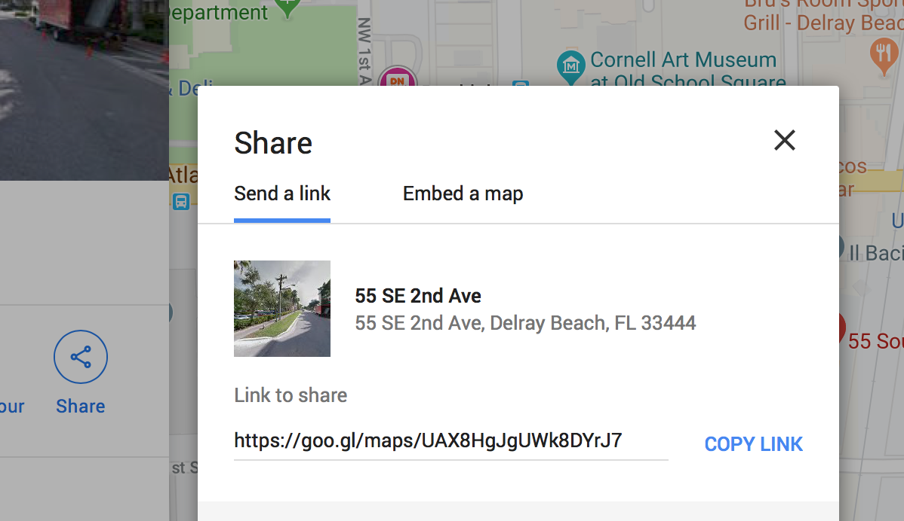

### Professional Offices
You can edit, add, or remove offices, which will be published to your website. 
- [Edit Office](#edit)
	- [Update Photo](#update-photo)
	- [Update Google Map](#change-map)
- [Add Office](#add)
- [Remove Office](#remove)

> The `"order": 1,` will always be used as your *headquarters*. If you want to update your headerquarters either update the details or give a new office the `1` value.


#### Edit
You can edit the details of any one of your offices. Go to your [Offices](../content/targets/offices.js) file. Edit any of the items on the list. Make sure to keep the formatting!!
```
export const offices = [
		{
			"order": 1,
			"office": "South Florida",
			"street": "55 SE 2nd Avenue",
			"suite": "Suite #203",
      "city": "Delray Beach, FL 33444",
      "map": "https://goo.gl/maps/Z3coEyzopSHMC1nY9",
			"phone": "(561) 926-9893",
			"email": "delray@tmct.law",
			"image": "map-delray.png"
		},
...
```

##### Update Photo
You can change the photo for any location. Upload the photo to your [Offices](../assets/offices/) folder. In order to publish the photo you need to either:
1. Use the same name as the current photo, like `map-delray.png`.
2. Edit the `image` name in your [Offices](../content/targets/offices.js) file. Make sure the file format is the same: png, jpg, ...
```
export const offices = [
		{
			"order": 1,
			"office": "South Florida",
			"street": "55 SE 2nd Avenue",
			"email": "delray@tmct.law",
			"image": "new-photo.png"		<-- photo file name
		},
...
``` 


##### Change Map
We use Google Maps for directions to your office location. Clients are able to click the link and see how to travel to your office. When you need to update an adress, make sure you update the google maps link. Go to [Google Maps](https://www.google.com/maps/). Enter your new address into the search bar. 
1. Click on the share icon and you should see a popup with a link. 



2. Copy that link and paste it into your [Offices](../content/targets/offices.js) file.
```
export const offices = [
		{
			"order": 1,
			"office": "South Florida",
      "map": "https://goo.gl/maps/Z3coEyzopSHMC1nY9",		<-- paste new link
			"phone": "(561) 926-9893",
			"email": "delray@tmct.law",
			"image": "map-delray.png"
		},
...
```


#### Add
When you want to add an office, open your [Offices](../content/targets/offices.js) file. Copy a current office, everything *between and with* the brackets `{...}`. Then edit the details ensuring to retain the formatting. 
1. Upload a new office photo. See notes [above](#upload-photo)
2. Add a Google Map Link. See notes [above](#change-map)
3. Make sure the `"order"` number is unique and in your preferential ordering.


#### Remove
Removing an offices is relatively straightforward. Simply delete everything *between and with* the brackets `{...}`. Then delete the photo.
1. Remove detals from [here](../content/targets/offices.js)
2. Remove photo from [here](../assets/offices/)


